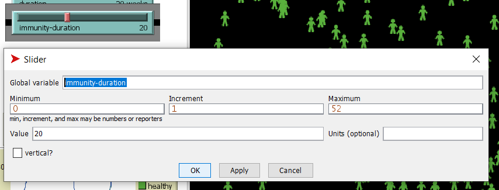
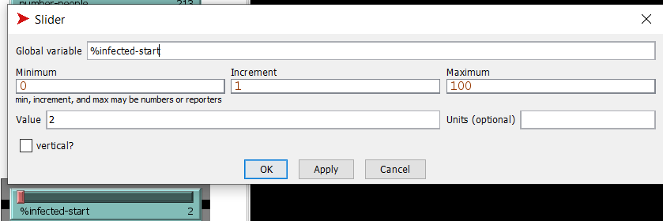
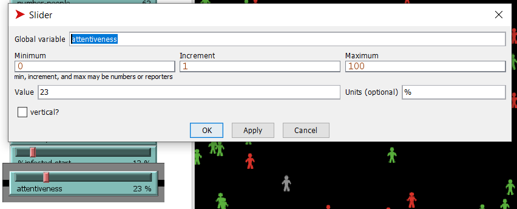
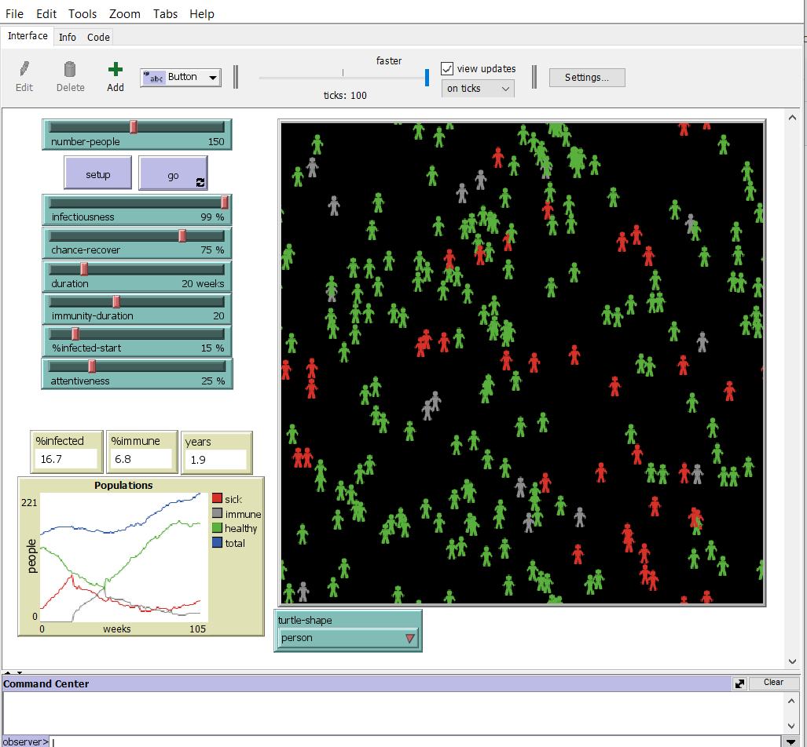
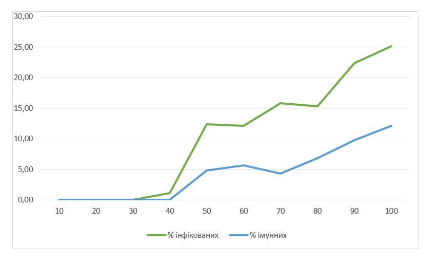

## Комп'ютерні системи імітаційного моделювання
## СПм-22-4, **Гайдай Ярослав Андрійович**
### Лабораторна робота №**2**. Редагування імітаційних моделей у середовищі NetLogo

 

### Варіант 3, модель у середовищі NetLogo:
[Virus](https://www.netlogoweb.org/launch#https://www.netlogoweb.org/assets/modelslib/Sample%20Models/Biology/Virus.nlogo)

 

### Внесені зміни у вихідну логіку моделі, за варіантом:

**Додано вплив віку на інфікування та результат захворювання.** 

Змінено процедуру **infect**. Додано змінну age-influence, яка відповідає за вплив віку на інфікування. Якщо людині більше 40 років або менше 10 років, то шанс заразитися на 10% більше.
<pre>
to infect ;; turtle procedure
  ask other turtles-here with [ not sick? and not immune? ]
  [
      let age-influence 0
      ifelse age > 40 * 52 or age < 10 * 52 [set age-influence 10][set age-influence 0]
      if (random-float 100) < (infectiousness + age-influence)
      [ get-sick ] 
  ]
end
</pre>

Змінено процедуру **recover-or-die**. Додано змінну age-influence, яка відповідає за вплив віку на результат захворювання. Якщо людині більше 40 років або менше 10 років, то шанс вихворіти не померши на 10% менше.
<pre>
to recover-or-die ;; turtle procedure
  if sick-time > duration                        ;; If the turtle has survived past the virus' duration, then
  [ 
      let age-influence 0
      ifelse age > 40 * 52 or age < 10 * 52 [set age-influence 10][set age-influence 0]
      ifelse random-float 100 < chance-recover - age-influence  ;; either recover or die
      [ become-immune ]
      [ die ] 
  ]
end
  </pre>

  
**Додано вплив ступеня поширення захворювання (поточного відсотка інфікованих) на вірогідність появи нових агентів.**

Змінено процедуру update-global-variables: додано встановлення chance-reproduce в залежності від кількості інфікованих.
Чим більше інфікованих, тим менше шанс появи нових агентів. Раніше вірогідність завжди була 1%.
<pre>
to update-global-variables
  if count turtles > 0
    [ set %infected (count turtles with [ sick? ] / count turtles) * 100
      set %immune (count turtles with [ immune? ] / count turtles) * 100 
      set chance-reproduce 1 - %infected / 100 
  ]
end
</pre>

**Додано можливість регулювання тривалості імунітету.** 

Видалено глобальну змінну.
<pre>
 immunity-duration
</pre>

Також видалено ініціалізацію тої змінної, тепер це робить слайдер.
<pre>
  to setup-constants
    set lifespan 50 * 52      ;; 50 times 52 weeks = 50 years = 2600 weeks old
    set carrying-capacity 300
    set chance-reproduce 1
end
</pre>

Налашутвання слайдера, який відповідає за тривалість імунітету:

### Внесені зміни у вихідну логіку моделі, на власний розсуд:

**Додано можливість змінювати початкову кількість хворих людей.** 

Змінено процедуру *setup-turtles*. Раніше на початку кожної симуляції обирались 10 людей, які будуть інфіковані. Тепер за кількість інфікованих людей на початку відповідає глобальна змінна *%infected-start* - це якийсь відсоток від всього наслення. Її значення визначається відповідним слайдером.
<pre>
  to setup-turtles
  create-turtles number-people
    [ setxy random-xcor random-ycor
      set age random lifespan
      set sick-time 0
      set remaining-immunity 0
      set size 1.5  ;; easier to see
      get-healthy ]
  ask n-of (count turtles / 100 * %infected-start) turtles
    [ get-sick ]
end
</pre>

Налашутвання слайдера, який відповідає за кількість хворих людей на початку симуляції:

**Покращено рух людей в симуляції.**
Люди будуть з деякою ймовірністю уникати хворих людей, йдучи від них в протилежну сторону, якщо поблизу немає хворих людей, то люди будуть просто ходити як і ранішу в випадкових напрямках. Для цього змінено процедуру *move*. 
<pre>
  to move ;; turtle procedure
  
  let nearby-turtles turtles in-radius 4
  let red-turtles (nearby-turtles with [color = red])
  
  ifelse any? red-turtles and not sick? and random-float 100 < attentiveness [
    face one-of red-turtles
    rt 180  ; Turn around
    fd 1  
  ]  [
    ; If there are no red turtles nearby, move randomly
    rt random 100
    lt random 100
    fd 1
  ]
end
</pre>

Налаштування слайдеру, який визначає, з якою ймовірністю люди будуть уникати хворих:

Скріншот моделі в процесі симуляції:

Фінальний код моделі та її інтерфейс доступні за [посиланням](Virus_better.nlogo). 
 

## Обчислювальні експерименти
### 1. Вплив заразності вірусу на кількість інфікованих
Досліджується залежність кількості інфікованих та імунних людей від заразності вірусу за 100 тактів.
Експерименти проводяться при 10-100 значеннях заразності, з кроком 10, усього 10 симуляцій.  
Інші керуючі параметри мають значення за замовчуванням:
- **number-people**: 150
- **chance-recover**: 75%
- **duration**: 20
- **immunity-duration**: 20
- **%infected-start**: 15%
- **attentiveness**: 25%

<table>
<thead>
<tr><th>Заразність</th><th>% інфікованих</th><th>% імунних</th></tr>
</thead>
<tbody>
<tr><td>10</td><td>0</td><td>0</td></tr>
<tr><td>20</td><td>0</td><td>0</td></tr>
<tr><td>30</td><td>0</td><td>0</td></tr>
<tr><td>40</td><td>1,1</td><td>0</td></tr>
<tr><td>50</td><td>12,4</td><td>4,8</td></tr>
<tr><td>60</td><td>12,1</td><td>5,7</td></tr>
<tr><td>70</td><td>15,8</td><td>4,3</td></tr>
<tr><td>80</td><td>15,3</td><td>6,8</td></tr>
<tr><td>90</td><td>22,4</td><td>9,8</td></tr>
<tr><td>100</td><td>25,1</td><td>12,1</td></tr>
</tbody>
</table>

Цей експеремент такий же, як експеримент 1 з 1 лабораторної але додано важливий параметр - "attentiveness" або уважність, що представляє собою ймовірність того, що люди уникатимуть хворих і триматимуться від них на відстані. З уважністю всього 25%, спостерігається значне зниження кількості інфікованих при всіх рівнях заразності порівняно з таким же експерементом з першої лабораторної. Це підтверджує, що уникання хворих сприяє зменшенню поширення вірусу в популяції.
